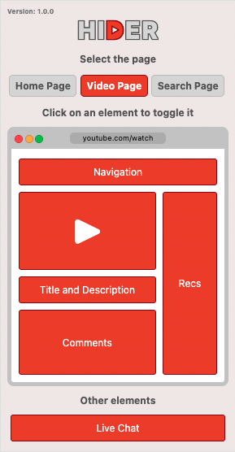

# Hider Chrome Extension
### Hider v1.0.2

Take back control of your focus and hide all distractions when surfing YouTube! 

Download this extension on Google Chrome: [Chrome Extension Download Page](https://chromewebstore.google.com/detail/hider/dnnpgmbhdojpjkpeeafgdelohfhbpiga?hl=en)

## How does it work? 
Hider allows you to:
1. Easily hide different page elements on YouTube while you browse
2. Eliminate distractions and avoid mindlessly clicking through YouTube videos with click-baity thumbnails
3. Remove unnecessary search results when searching for videos ("People also watched", "For You" and more)

You can toggle the following elements:
Home Page:
- Navigation bar
- Side bar
- All videos
- Shorts
- Thumbnails

Video Page:
- Navigation bar
- Video player
- Recommendations
- Title and Description
- Comments
- Thumbnails
- Live Chat

Search Results Page:
- Navigation bar
- Side bar
- All results
- Shorts
- Thumbnails
- Irrelevant Search Results ("People Also Watched", "For You" and more)

### Designed and developed by Benjamin Floyd Rubin